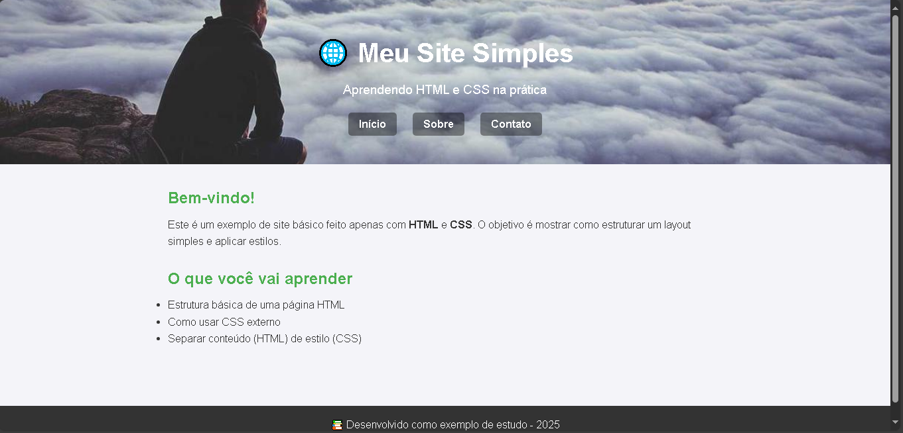

# 🌐 Site Simples com HTML e CSS  

  
  
  
  

---

<p align="center">
  
</p>

---

Este repositório contém um exemplo de **site básico** utilizando apenas HTML e CSS.  
O objetivo é ajudar iniciantes a compreenderem como estruturar páginas da web e aplicar estilos visuais de forma prática.  

---

## 📑 Tabela de Conteúdos  

- [🚀 Funcionalidades](#-funcionalidades)  
- [🛠️ Tecnologias usadas](#-tecnologias-usadas)  
- [📸 Demonstração](#-demonstração)  
- [📂 Estrutura do projeto](#-estrutura-do-projeto)  
- [💡 Como usar](#-como-usar)  
- [📖 Aprendizado](#-aprendizado)  
- [🤝 Contribuições](#-contribuições)  
- [📬 Contato](#-contato)  
- [🗺️ Roadmap](#️-roadmap)  
- [✍️ Autoria](#-autoria)  
- [📜 Licença](#-licença)  


---

## 🚀 Funcionalidades
- Estrutura HTML básica  
- CSS externo para estilização  
- Exemplo de layout simples (cabeçalho, conteúdo e rodapé)  
- Código comentado para facilitar o aprendizado  

---

## 🛠️ Tecnologias usadas
- **HTML5**  
- **CSS3**  

---

## 📸 Demonstração  

<p align="center">
  <a href="[https://exemplo-de-site-simples.netlify.app/]" target="_blank">
    🔗 Clique aqui para ver o site rodando!
  </a>
</p>

---

## 📂 Estrutura do projeto

site-Simples-com-HTML-e-CSS/  
│  
├── index.html  
├── style.css  
├── README.md  
└── exemplo.jpg  

---

## 💡 Como usar
1. Clone o repositório:
```bash
git clone https://github.com/Carolina-wp/site-Simples-com-HTML-e-CSS.git
```
2. Acesse a pasta do projeto:
 ```bash 
cd site-Simples-com-HTML-e-CSS
```
3. Abra o arquivo index.html diretamente no navegador.

## 📖 Aprendizado

Este projeto é ideal para:

🧑‍🎓 Estudantes que estão dando os primeiros passos no desenvolvimento web

🖥️ Quem deseja entender como separar HTML (estrutura) e CSS (estilo)

🚀 Criar uma base sólida antes de avançar para JavaScript ou frameworks modernos

## 🤝 Contribuições  

Contribuições são sempre bem-vindas! 🎉  
Se você deseja melhorar este projeto, siga os passos:  

1. Faça um fork do repositório  
2. Crie uma nova branch:  
```bash
git checkout -b minha-feature
```
3. Commit suas alterações:
```bash
git commit -m 'Adicionei nova feature'
```
4. Envie a branch:
```bash
git push origin minha-feature
```
5. Abra um Pull Request 🚀

## 📬 Contato

💌 Se quiser trocar uma ideia ou dar sugestões:

[](https://github.com/Carolina-wp)
[](https://www.linkedin.com/in/carolina-morais-7913172b3/)
[](mailto:carolinamorais063@gmail.com)

## 🗺️ Roadmap  

- [ ] Adicionar versão responsiva para dispositivos móveis  
- [ ] Criar novas páginas (sobre, contato)  
- [ ] Implementar temas diferentes (claro/escuro)  
- [ ] Melhorar acessibilidade do site  
- [ ] Adicionar explicação em vídeo sobre o código  

---

## ✍️ Autoria  

Projeto desenvolvido por **Carolina Morais** 💻✨  
- [LinkedIn](https://www.linkedin.com/in/carolina-morais-7913172b3/)  
- [GitHub](https://github.com/Carolina-wp)
  
## 📜 Licença

Este projeto está sob a licença MIT.
Você pode usar, modificar e distribuir livremente, desde que mantenha os créditos.

